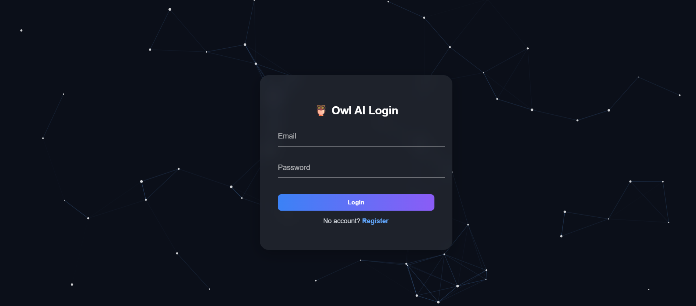

# 🦉 Owl AI - Internship & Project Platform

A comprehensive, full-stack MERN-like (MongoDB, Express, React, Node.js-style Python/Flask) platform designed to connect users with internships and projects. This application features distinct dashboards and functionalities for both regular users and administrators.

## ✨ Key Features

Owl AI provides a seamless experience for both applicants and administrators, with a feature-rich environment tailored to each role.

### 👤 User Features

- **Secure Authentication**: Users can register and log in securely using a JWT-based authentication system.
- **Interactive Dashboard**: A dynamic and visually appealing dashboard serves as the user's central hub, showcasing available internships and projects.
- **Detailed Listings**: Users can view in-depth details for each project and internship, including description, tech stack, features, implementation guides, and timelines.
- **Application System**: A streamlined application process allows users to apply by submitting their name, email, and a PDF resume.
- **Application Tracking**: The dashboard's "Applied" section lets users track the real-time status of their applications (Submitted, Approved, Rejected, Completed).
- **Work Submission Portal**: Once an application is approved by an admin, the user gains access to a form to submit their work, including GitHub repositories, live demo URLs, and documentation links.
- **Animated UI**: The interface is brought to life with framer-motion for smooth animations and tsparticles for an engaging background effect.

### 🛡️ Admin Features

- **Dedicated Admin Dashboard**: A separate, secure dashboard for administrators to manage the entire platform.
- **CRUD for Opportunities**: Admins have full Create, Read, Update, and Delete (CRUD) capabilities for both projects and internships.
- **Application Management**: View and manage all user applications for every project and internship. Admins can review applicant details, open resumes, and view submitted work.
- **Status Control**: Admins can approve or reject applications, which instantly updates the status on the user's dashboard.
- **User Management**: View a list of all registered users on the platform.

## 📸 Screenshots

A picture is worth a thousand words. Here's a glimpse into the Owl AI platform.



### User Dashboard
Shows available internships and projects, along with the user's application status.


### Admin Dashboard
The central control panel for managing projects, internships, users, and applications.


## 🛠️ Tech Stack

This project is built with a modern, full-stack architecture.

### Frontend:
- **Framework**: React (Vite)
- **Routing**: React Router
- **Styling**: Inline CSS-in-JS & CSS animations
- **Animation**: Framer Motion
- **Background Effects**: tsParticles

### Backend:
- **Framework**: Flask (Python)
- **Database**: MongoDB

## 🚀 Live Demo

Check out the live demo of the application to see it in action:

🔗 [https://owlinternship.netlify.app/](https://owlinternship.netlify.app/)

Explore the platform, view available internships and projects, and experience the user interface firsthand. The demo is connected to a live backend, so you can test the complete application flow including user registration, application submission, and more.
- **ODM**: PyMongo
- **Authentication**: Flask-JWT-Extended
- **CORS Handling**: Flask-Cors

### Database:
- MongoDB

## 🚀 Getting Started

To get a local copy up and running, follow these simple steps.

### Prerequisites

Make sure you have the following installed on your machine:
- Node.js & npm (or yarn)
- Python 3 & pip
- MongoDB (either running locally or via a cloud service like MongoDB Atlas)

### 1. Backend Setup

```bash
# Clone the repository
git clone https://github.com/your-username/owl-ai-platform.git
cd owl-ai-platform/backend

# Create a virtual environment
python -m venv venv
source venv/bin/activate  # On Windows, use `venv\Scripts\activate`

# Install the required Python packages
pip install -r requirements.txt

# Create a .env file in the backend directory and add your configuration
# (see the Environment Variables section below)

# Run the Flask server
flask run
```

The backend will now be running on http://127.0.0.1:5000.

### 2. Frontend Setup

```bash
# Navigate to the frontend directory in a new terminal
cd ../frontend

# Install npm packages
npm install

# Run the React development server
npm run dev
```

The frontend will now be running on http://localhost:5173.

## Environment Variables

For the backend to connect to the database and manage JWTs, you need to create a `.env` file in the backend directory with the following variables:

```env
# Your MongoDB connection string
MONGO_URI="mongodb://localhost:27017/owl_db"

# A strong, secret key for JWT encryption
JWT_SECRET_KEY="your-super-secret-key-that-is-long-and-random"
```

## 📝 API Endpoints

The backend provides the following RESTful API endpoints:

| Method | Endpoint | Description | Auth Required | Admin Required |
|--------|----------|-------------|---------------|----------------|
| POST   | /auth/register | Register a new user. | No | No |
| POST   | /auth/login | Log in a user. | No | No |
| POST   | /auth/admin-login | Log in an admin. | No | No |
| GET    | /api/projects | Get all projects. | Yes | No |
| POST   | /api/projects | Create a new project. | Yes | Yes |
| PUT    | /api/projects/<id> | Update a project. | Yes | Yes |
| DELETE | /api/projects/<id> | Delete a project. | Yes | Yes |
| GET    | /api/internships | Get all internships. | Yes | No |
| POST   | /api/internships | Create a new internship. | Yes | Yes |
| GET    | /api/users | Get all users. | Yes | Yes |
| GET    | /api/my_applications | Get applications for the logged-in user. | Yes | No |
| POST   | /api/apply_project/<id> | Apply for a project. | Yes | No |
| POST   | /api/apply_internship | Apply for an internship. | Yes | No |
| PUT    | /api/project_applications/<id>/status | Update the status of a project application. | Yes | Yes |
| PUT    | /api/project_applications/<id>/submission | Submit work for a project application. | Yes | No |
